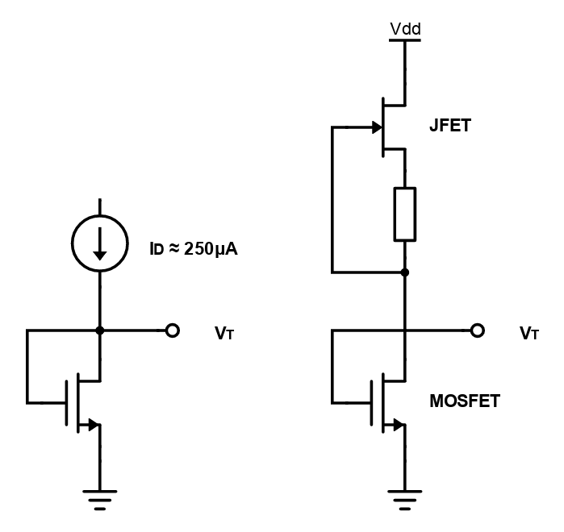
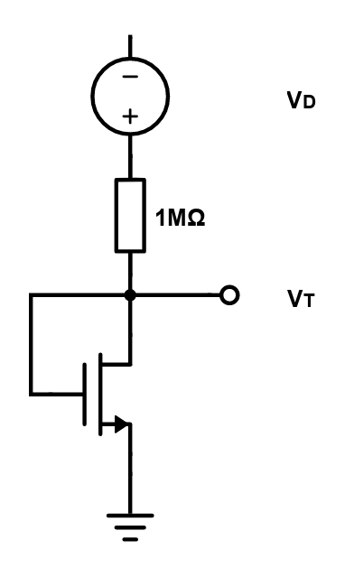
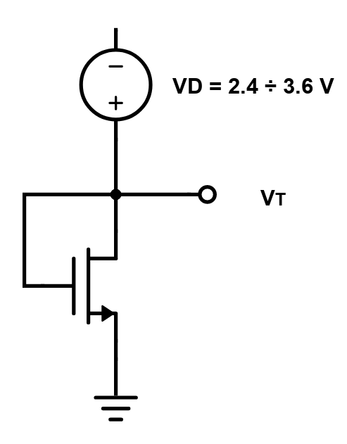
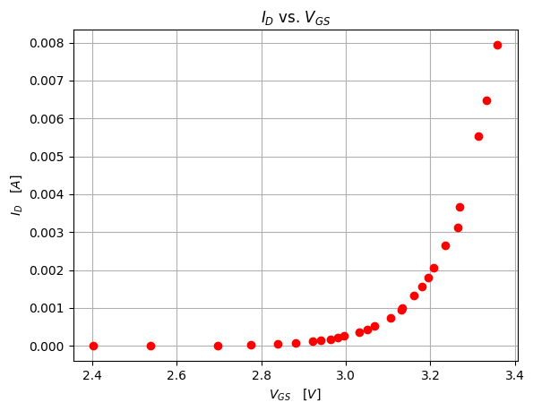
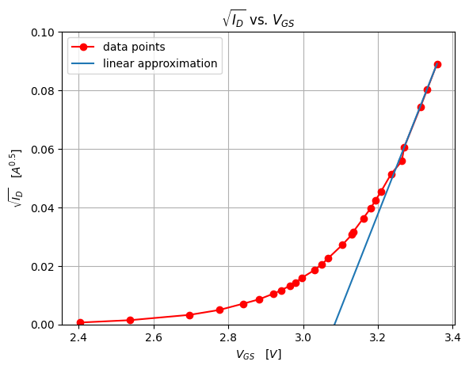
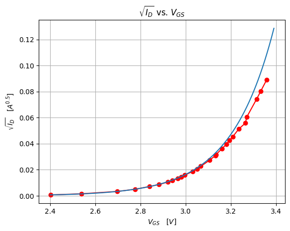

# Experimental extraction of relevant MOSFET parameters 

We require for drain-to-source resistance calculations and for MOSFET calculations in general an accurate characterisation of MOSFET parameters.
## Theoretical determination and experimental approximation of parameters
At a purely theoretical level $I_{D}$ will be a function of two variables: $V_{GS}$ and $V_{DS}$. We take for example $R_{DS}$ in the Triode Region.

To determine its formula and value we need to take the partial derivative of $I_{D}$ with respect to $V_{DS}$ and voila. But there's a problem, we can't take the derivative when measuring currents and voltages with a multimeter. 

So instead of taking the derivative we will be calculating the slope of the curve, as we assume the IV characteristic of the FET to be mostly linear. After all, should we take two point infinitesimally close to each other, the resulting slope would have the same value as the derivative.

Note that for the parameter extraction we'll be doing, the selected transistor will be an IRF830.
## Measuring $V_{T}$
Threshold voltage can be defined in many ways, it all depends on what "threshold" current we decide to set as a benchmark.

I attempted to determine the value of $V_{T}$ with the help of several distinct testing methods:
- Constant Current Method: Biasing the FET with a constant current $I_{D}$ = 250 $\mu A$ and measuring $V_{GS}$
- Linear Extrapolation in Saturation Region: Diode-connected FET is biased by a variable voltage source and the threshold voltage is subsequently graphically determined
- Extraction from characteristic FET equation

### The Constant Current Method
This method works by setting a current source to output a constant, voltage independent drain current $I_{D}$ = 250 $\mu A$ into the Drain, which is shorted to the Gate of the device.

    
     
     
    <a><b>CCS implementation</b></a>

 
 

The CCS was built from a JFET and a resistor, a combination also called "constant current diode", as it can be seen in the figure from above.
The output current of the source is dictated by the resistance, which for a desired current $I_{D}$ has this formula: $R_{S}=\frac{V_{GS(off)}\cdot\left(1-\sqrt{\frac{I_{D}}{I_{DSS}}}\right)}{I_{D}}$. On the bench the fixed resistor was supplanted by a potentiometer to avoid having to extract the values of $I_{DSS}$ and $V_{GS(off)}$ for the specific transistor in use.

In our specific example the potentiometer was set to 2.922 $K\Omega$ and $I_{D}$ reached 255.6 $\mu A$, giving us the value of the threshold voltage as $V_{T}$ = 2.97V.

#### Notes on alternative arrangements for a CCS
An active device is not always required for this method, as a quicker, bench-friendlier method is to just measure $V_{GS}$ when the FET is supplied through a 0.1/1/10 $M\Omega$ resistor and the current is closer to another industry-standard current benchmark: $I_{test}=100 nA\cdot \frac{W}{L}$

    
     
     
    <a><b>Simpler bench-friendly test method</b></a>

 
 

### Linear Extrapolation in Saturation Region
This method necessitates the use of a diode-connected MOSFET and a variable supply voltage. Whilst performing the measurement and calculations, we must acknowledge that above the threshold voltage the FET is saturated because: $V_{GS}=V_{DS}$, $V_{GS}-V_{T} = V_{DS}-V_{T} < V_{DS}$
While varying the gate voltage we monitor the increase in current. After we gather all the data we graph $I_{D}$ vs $V_{GS}$. 

We can observe two distinct regions in the graph, above the threshold and below threshold (subthreshold region). In the above-threshold region the characteristic equation for the FET is valid, whilst in the subthreshold region the current ceases to obey the usual characteristic equations.

We come up with another proper formula for the variation of $I_{D}$ in terms of $V_{GS}$ and $V_{DS}$:
$$I_{D}=I_{S}\cdot e^{\frac{V_{GS}}{\zeta U_{t}}}\cdot\left(1-e^{-\frac{V_{DS}}{\zeta U_{t}}}\right)$$

For $V_{DS}>4\cdot U_{t}$ the formula simplifies to: $I_{D}=I_{S}\cdot e^{\frac{V_{GS}}{\zeta U_{t}}}$, where $U_{t}$ is the thermal voltage and $\zeta$ is the non-ideality factor. In our test circuit $V_{DS}$ and $V_{GS}$ will be equal.

Above $V_{GS}$ = $V_{T}$, $\sqrt{I_{D}}$ will be linear and equal to $K\cdot (V_{GS}-V_{t})$. We take two points in the linear region of the graph and define the line passing through, where $V_{T}$ is to be its X-intercept.

The test circuit looks like this:

    
     
     
    <a><b>Linear Extrapolation in Saturation Region test circuit implementation</b></a>

 
 

The gathered data points are represented below:

    
     
     
    <a><b>Experimentally obtained data points</b></a>

 
 

And this is how the threshold voltage is determined graphically:

    
     
     
    <a><b>Linear approximation and graphical threshold voltage determination</b></a>

 
 

And here we have an approximation for the characteristic equation in the subthreshold region:

    
     
     
    <a><b>Subthreshold Region and characteristic equation</b></a>

 

$$ \begin{cases}
I_{D1}=I_{S}\cdot e^{\frac{V_{GS1}}{\zeta U_{t}}}\\
\\ 
I_{D2}=I_{S}\cdot e^{\frac{V_{GS2}}{\zeta U_{t}}}
\end{cases}$$

 

$$\zeta = \frac{V_{GS1}-V_{GS2}}{U_{t}\cdot ln\left(\frac{I_{D1}}{I_{D2}}\right)}$$

 

$$I_{S}=\frac{I_{D}}{e^{\frac{V_{GS}}{\zeta U_{t}}}}$$

### Extraction from characteristic FET equation
We take two bias points and with the help of characteristic equation we find an expression of the form $V_{T} = f\left(V_{GS1},V_{GS2},I_{D1},I_{D2}\right)$ . One important contstraint that we must impose is that the value of the threshold voltage is smaller than both $V_{GS}$

$$ \frac{I_{D1}}{I_{D2}} = \frac{K (V_{GS1} - V_{T})^{2}}{K (V_{GS2} - V_{T})^{2}} $$

$$ I_{D1}{V_{GS}}^{2} - 2 V_{GS2} V_{T} I_{D1} + {V_{T}}^{2} I_{D1} = I_{D2} {V_{GS1}}^{2} - 2 V_{GS1} V_{T} I_{D2} + {V_{T}}^2 I_{D2} $$

which resolves to this:

$$ {V_{T}}^2 (I_{D2} - I_{D1}) + V_{T} (2V_{GS2} I_{D1} - 2V_{GS1} I_{D2}) + I_{D2} {V_{GS1}}^2 - I_{D1} {V_{VGS2}}^2 = 0 $$

The equation has the following solutions:

$$ V_{T} = \frac{ -2 (V_{GS2} I_{D1} - V_{GS1} I_{D2} ) }{ 2 (I_{D2} - I_{D1}) } \pm \frac{ \sqrt{ (2 V_{GS2} I_{D1} - 2 V_{GS1} I_{D2})^{2} - 4 (V_{GS2}^{2} I_{D1} - V_{GS1}^{2} I_{D2}) (I_{D2} - I_{D1}) } }{ 2 (I_{D2} - I_{D1}) } $$

After we numerically determine the solutions, we check that $V_{T}$ is to the left of both $V_{GS}$ values used.

## Conclusions
- There are a **lot** of testing methods for $V_{T}$
- Linear interpolation and log-fitting are better options for parameter extraction, but require more time and resources
- Rough values are better than no values
- Better equipment, better results

## Sources and Useful Resources
- https://www.scirp.org/journal/paperinformation.aspx?paperid=72393
- http://web02.gonzaga.edu/faculty/talarico/EE303/HO/squarelawIssues.pdf
- https://2n3904blog.com/sub-threshold-conduction-of-a-power-mosfet/
- https://www.slideshare.net/dsvidhya/chapter3-49826795
- http://wla.berkeley.edu/~ee40/fa03/lecture/lecture23.pdf
- https://pdfs.semanticscholar.org/b850/bf8c20f34c04bc8f5d3c615ce9934e21fb10.pdf
- https://www.vishay.com/docs/90715/an957.pdf
- https://www.taiwansemi.com/assets/uploads/productcategoryfile/AN-1001_A1611.pdf
- https://download.tek.com/document/1KW-60515-0%20PowerSupply%20Design%20Poster.pdf
