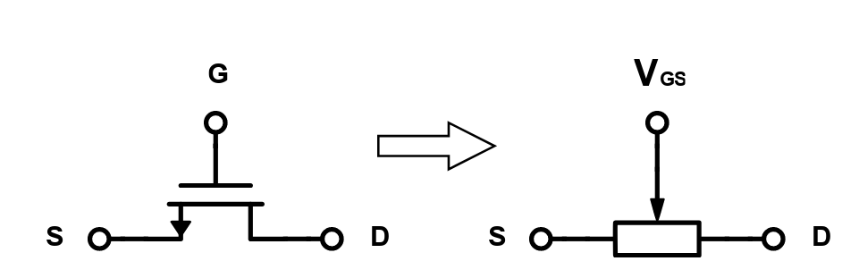
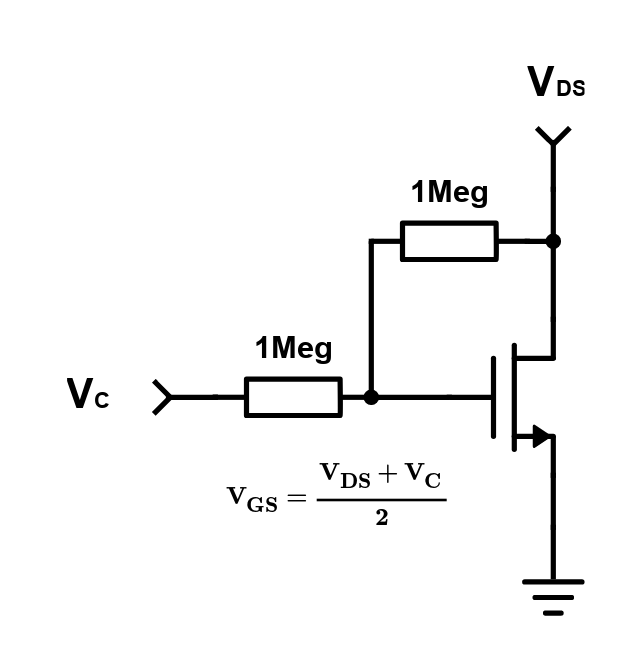
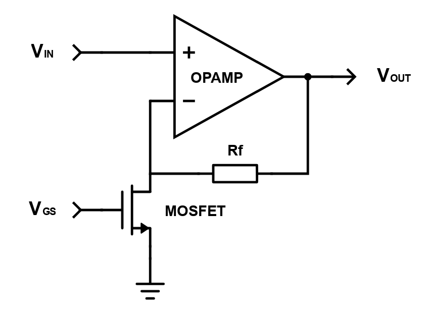

# MOSFET-based Voltage Controlled Resistor
MOSFETs are a type of Field Effect Transistors (FETs) frequently used for load switching and signal amplification. 
Besides the aforementioned use cases, there exists a third possible use case: Voltage Controlled Resistors (VCRs). 
This use case requires driving the FET into the deep triode region.

VCRs can be useful on their own, as part of voltage dividers, but their usefulness can be greatly enhanced by using them to craft Amplifiers with Voltage Controlled Gain.

## MOSFET CHARACTERISTICS
These are the useful operating regions for a Field Effect Transistor:
- Triode Region (also known as Ohmic or Linear Region) $\Rightarrow$ The FET acts as a Voltage Controlled Resistor with a theoretical resistance nearing zero ohms
- Saturation Region (also sometimes called Active Region) $\Rightarrow$ The FET acts a Voltage Controlled Current Source with a theoretical infinite output resistance
- Cutoff Region $\Rightarrow$ The FET acts as a closed switch with a theoretically infinite resistance

    
     
     
        <a href="https://services.montefiore.uliege.be/microelec/uploads/ELEN0037/Lectures/Lecture%202%20Revision%20MOSFET%20Operation%20and%20Modelling.pdf"><b>MOSFET Operating Regions</b></a>

 
 

We can describe the electrical characteristics of the MOSFET in the Triode and Saturation Regions with the following piecewise function:

$$\begin{cases}
I_{D}=\frac{1}{2}\mu_{n}C_{ox}\frac{W}{L}\cdot \left[2\(V_{GS}-V_{T}\)V_{DS}-V_{DS}^{2}\right]\quad\text{for}\quad V_{GS}>V_{T}\quad\text{and}\quad V_{DS}\leq V_{GS}-V_{T}\\
\\
I_{D}=\frac{1}{2}\mu_{n}C_{ox}\frac{W}{L}\cdot \left(V_{GS}-V_{T}\right)^{2}\cdot \(1+\lambda V_{DS}\)\quad\text{for}\quad V_{GS}>V_{T}\quad\text{and}\quad V_{DS}\geq V_{GS}-V_{T}\\
\end{cases}$$

 
 

We are mainly interested in the large signal model of the FET in the triode region. As we approach the transition region between linear and saturation regions we encounter more and more non-linearities. At very low voltages, way below pinch-off voltage we enter the deep triode region and the nonlinearities present at highter voltages can be neglected as we simulate the FET as a voltage controlled resistor.
 
 
So, for $V_{DS} << 2\cdot\left(V_{GS}-V_{T}\right)$ we get $I_{D}=\mu C_{ox}\frac{W}{L}\left(V_{GS}-V_{T}\right)V_{DS}$. For higher sub-pinch-off voltages we get more non linear terms and have to contend with a more complex characteristic equation:
$$I_{D}=\mu C_{ox}\frac{W}{L}\left[\left(V_{GS}-V_{T}\right)V_{DS}-\frac{V_{DS}^{2}}{2}\right]$$
 
 

The formula for the drain-to-source resistance ($R_{DS}$), when the transistor is driven into the **deep triode** region, is derived as follows:
$$\frac{1}{R_{DS}}=\frac{\partial I_{D}}{\partial V_{DS}}=\frac{\partial \mu C_{ox}\frac{W}{L}\cdot\left(V_{GS}-V_{T}\right)\cdot V_{DS}}{\partial V_{DS}}=\mu C_{ox}\frac{W}{L}\cdot\left(V_{GS}-V_{T}\right)$$

So, $R_{DS}$ is equal to $\frac{1}{\mu C_{ox}\frac{W}{L}\cdot\left(V_{GS}-V_{T}\right)}$ for very low $V_{DS}$.

The MOSFET is now akin to a variable resistor, controlled by $V_{GS}$.

    
     
     
    <a><b>MOSFET as VCR</b></a>

 
 

We also introduce the notion of $R_{DS(on)}$, the drain-to-source resistance of the FET when $V_{GS}$ is equal to zero, which is also the minimum on resistance of the device. So for any particular $V_{GS}$ we can derive the following formula to determine the value of the on resistance (which is usually a parameter given in d/s):

$$R_{DS(on)}=\frac{1}{\mu C_{ox}\frac{W}{L}\cdot\left(-V_{T}\right)}$$

$$\frac{R_{DS(on)}}{R_{DS}}=\frac{\mu C_{ox}\frac{W}{L}\cdot\left(V_{GS}-V_{T}\right)}{\mu C_{ox}\frac{W}{L}\cdot\left(-V_{T}\right)}=\frac{V_{GS}-V_{T}}{-V_{T}}$$

$$R_{DS}=R_{DS(on)}\cdot \frac{-V_{T}}{V_{GS}-V_{T}}=\frac{R_{DS(on)}}{1-\frac{V_{GS}}{V_{T}}}$$

### Small-signal model for VCR
If we desire to use the MOSFET for small-signal AC applications we must take into account that for a given excursion $v_{ds}$ around the bias point of the FET we get: $v_{DS} = V_{DS} + v_{ds}$, where $v_{ds}$ is the applied AC signal at the FET's Drain. We are practically using the superposition principle and overlaying the large- and small-signal models of the FET in order to precisely simulate the operational behaviour.
 
 
If there are no AC variations in the gate-to-source voltage, the overall drain current equations reduces to this form: $i_{D}=I_{D}+i_{d}=I_{D}+g_{ds}\cdot v_{ds}= I_{D}+\frac{\partial I_{D}}{V_{DS}}\cdot v_{ds}$, where $\frac{\partial I_{D}}{V_{DS}}$ is equal unsurprisingly to $\mu C_{ox}\frac{W}{L}\left(V_{DS}-V_{T}\right)$.
 
 
After all is said and done, the overarching equation for the FET when biased in the deep triode region and supplied at its drain with a small AC signal looks like this:

$$i_{D}=\mu C_{ox}\frac{W}{L}\left(V_{DS}-V_{T}\right)\cdot\left(V_{DS}+v_{ds}\right)$$.

## LINEARIZING MOSFET ON RESISTANCE
Up until now we've neglected the non-linear terms of the triode region FET model. There are circumstances in which this terms become important and can affect the ohmic characteristics of the transitor. To remedy this we seek to linearize the $R_{DS}$.
 
 
Taking into account the nonlinearities of the transition region, we obtain the following formula: 
$$I_{D}=\frac{1}{2}\mu_{n}C_{ox}\frac{W}{L}\cdot \left[2\(V_{GS}-V_{T}\)V_{DS}-V_{DS}^{2}\right]$$

Dividing $I_{D}$ by $V_{DS}$ we obtain: $R_{DS}= \mu_{n}C_{ox}\frac{W}{L}\cdot \left[V_{GS}-V_{T}-\frac{V_{DS}}{2}\right]$.

We need to get rid of $V_{DS}$ from the formula of $R_{DS}$. How do we do that? We use two very high value resistors (think 0.5 to 1 $M\Omega$) to form a potential divider with $V_{GS}$ as the midway point and $V_{DS}$ and a new control voltage $V_{C}$ at the opposite ends. It follows that $V_{GS} = \frac{V_{C}+V_{DS}}{2}$.

    
     
     
    <a><b>Linearized VCR</b></a>

 
 

Rewriting $\frac{1}{R_{DS}}$ we can see that the two $V_{DS}$ terms cancel each other and we obtain a pleasant $V_{DS}$-independent relationship between the control voltage and the device resistance:

$$\frac{1}{R_{DS}}=\mu_{n}C_{ox}\frac{W}{L}\cdot \left(\frac{V_{C}+V_{DS}}{2}-V_{T}-\frac{V_{DS}}{2}\right)=\mu_{n}C_{ox}\frac{W}{L}\cdot \left(\frac{V_{C}}{2}-V_{T}\right)$$

## LINEAR GAIN CONTROLLED AMPLIFIER
We can now build a non-inverting operation amplifier with variable gain by exchanging one of the feedback resistors with a MOSFET.
The gain of the amplifier shown below will be $A=1+\frac{R_{f}}{R_{DS}}$.

    
     
     
    <a><b>Variable Gain Amplifier with VCR</b></a>

 
 

The most important design constraint when building the amplifier circuit is the limited amplitude of the input signal, as it should be always under 100mV or even lower. We can choose to further linearize the equivalent MOSFET on resistance as shown above, but the effects will be limited as $V_{DS}$ is quite small.

A significant difference between the linearized $R_{DS}$ circuit and the regular one will be that for any given $V_{GS}$ the control voltage $V_{C}$ of the linearized VCR will be double the desired $V_{GS}$. So the linearized VCR will have a narrower range of possible values, when compared to its regular counterpart.

## NOTES
- In **"MOSFET relevant Parameter extraction"** I discuss both the theoretical and practical aspects of my approach to parameter extraction. We're interested in Channel-length Modulation Factor ($\lambda$), The Technology Constant ($K$) and the Threshold Voltage ($V_{T}$).
- In **"MOSFET-based Variable Gain Operation Amplifier"** I present my findings from building the amplifier proposed in the "Linear Gain Controlled Amplifier" chapter of the current document.

## CONCLUSIONS
- JFETs with their crappy high on resistances are better for variable gain applications
- There is no pinch-off in the Triode Region
- I have much more to learn about FETs, both in their power applications and in logic level applications
## SOURCES
-  <a href="https://www.youtube.com/watch?v=cdZiwwAIOp4&ab_channel=MansoorKhan">Finite output resistance of MOSFET</a>
-  <a href="https://www.allaboutcircuits.com/technical-articles/understanding-mosfet-on-state-drain-to-source-resistance/">MOSFET on state drain source resistance</a>
-  <a href="https://www.vishay.com/docs/70598/70598.pdf">JFET VCR app note</a>
-  <a href="https://www.onsemi.cn/pub/collateral/an-6603cn.pdf
">Linear Gain Controlled Amplifier app note</a>
-  <a href="https://neurophysics.ucsd.edu/courses/physics_120/The%20Field%20Effect%20Transistor%20as%20a%20Voltage%20Controlled%20Resistor.pdf
">On resistance linearization </a>
-  <a href="https://www.tina.com/resources/home/field-effect-transistor-amplifiers-2/2-metal-oxide-semiconductor-fet-mosfet/
">Large signal model for FETs</a>
-  <a href="https://inst.eecs.berkeley.edu//~ee105/fa98/lectures_fall_98/091898_lecture11.pdf
">Derivation of small signal model for FETs</a>
-  <a href="https://electronics.stackexchange.com/questions/179592/small-signal-models-of-mos-amplifiers
">How the calculus works</a>
-  <a href="https://www.youtube.com/watch?app=desktop&v=x4m8GwOdHhk&ab_channel=techgurukula
">Small-signal model for the Triode Region </a>
-  <a href="https://services.montefiore.uliege.be/microelec/uploads/ELEN0037/Lectures/Lecture%202%20Revision%20MOSFET%20Operation%20and%20Modelling.pdf
">More in-depth material</a>

